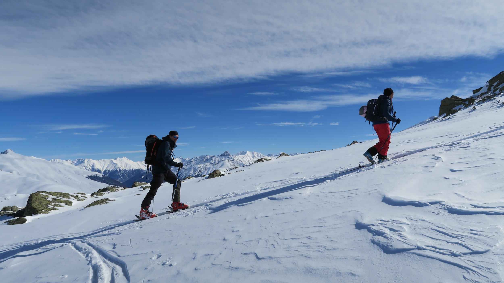

# Fotografie
Bilder dienen dazu, Erlebnisse und Emotionen sowie die Schönheit der Bergwelt festzuhalten und mit anderen zu teilen. 


## Datenschutz
- **Während den Touren** des SAC Bernina werden von Teilnehmenden und Tourenleitenden Fotos gemacht. Eine Auswahl dieser Fotos wird auf der Website der Sektion Bernina, auf Social-Media und in der Zeitschrift "Il Bernina" veröffentlicht. Wer nicht auf den Bildern erscheinen möchte, teilt das bitte eingangs einer Tour dem Tourenleitenden und den Teilnehmenden mit.
- Werden Bilder für kuratierte Zwecke verwendet, wird bei den erkennbaren Personen um deren Einwilligung zur Publikation, inkl. Angabe des Verwendungszwecks, gebeten.


## Bildsprache
- Die Bildsprache der Sektion Bernina ist authentisch, natürlich und lebendig. 
- Sie spiegelt die Vielfalt und Schönheit der Bergwelt wider und zeigt Menschen beim Bergsport in der Natur. 
- Die Fotografien sollen die Begeisterung für den Bergsport und die Bergwelt vermitteln und die Werte der Sektion Bernina widerspiegeln.
- Die Bilder sollen kein Risikoverhalten zeigen, das Nachahmer zu gefährlichen Aktionen verleiten könnte.


## Anforderungen an kuratierte Bilder
- Die publizierten Bilder weisen eine gute technische Qualität auf, sprich eine ausreichende Auflösung (min. 2500px für Web, 300dpi für Print).
- Die Bilder sind scharf und gut belichtet (Nachbearbeitung). 
- Die Farben sind natürlich und nicht übermässig bearbeitet.


## Anforderungen an Tourenbilder/Bildergalerie
- Bilder von Touren für die Bildergalerie haben keine Anforderungen an die technische Qualität.
- Die Bilder sind in der Regel unbearbeitet und zeigen die Realität.


## Copyright
- Jedes veröffentlichte Bild wird (dem Ausgabemedium zweckmässig) mit dem Namen der Fotografin oder des Fotografen versehen.
- Statt dem Prefix "Foto:" kann auch ein Symbol verwendet werden, auf das Copyright-Zeichens (©) wird verzichtet.
```
Foto: Albert Steiner
```

<!--
## Anwendungsbeispiele

-->