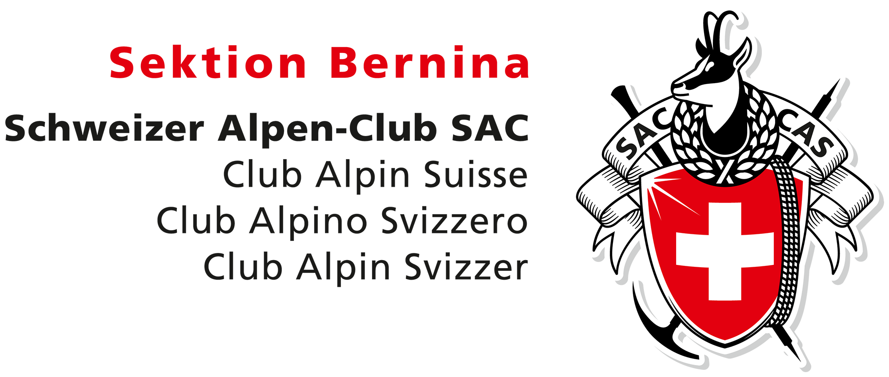
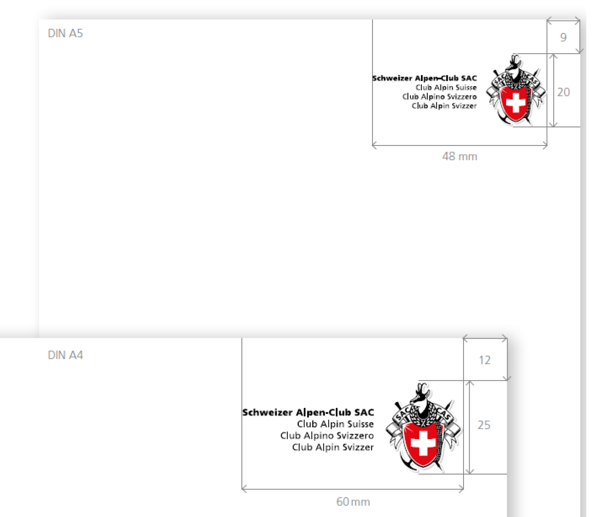
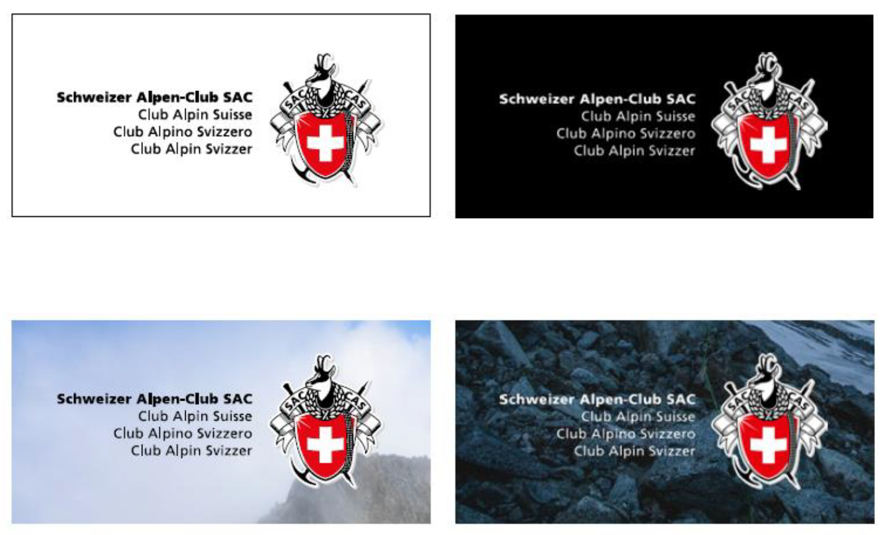

# Logo
Das Logo der SAC-Sektion Bernina ist ein zentrales Element des visuellen Auftritts. Hier finden sich alle relevanten Informationen zur korrekten Verwendung des Logos, einschliesslich der verfügbaren Downloads.

## Das Logo der SAC-Sektion Bernina

<Columns> 
    <Column className='text--left'>
        Das Logo der Sektion Bernina setzt sich aus einer Wortmarke und einer Bildmarke zusammen und wird ausschliesslich als Einheit eingesetzt (Ausnahme Kleinstanwendungen). Oberhalb der viersprachigen Bezeichnung steht jeweils der Name der Sektion bzw. des Regionalzentrums. Das Logo besteht aus den Farben Rot, Schwarz, Weiss und Grau (Farbwerte siehe [«Farbwelt»](./farbwelt)).

        **Sämtliche Logos sind in verschiedenen Formaten im Bereich [Vorlagen](./vorlagen) zu finden.**
    </Column>
    <Column className='text--center'>
        
    </Column>
</Columns>

### Das Logo der Jugendorganisation (JO)
Für die Jugendorganisationen der Sektionen existiert kein eigenes Logo. Sie verwenden ebenfalls das Sektions-Logo.[^1]

### Sprache
Beim Logo der Sektion Bernina kommt ausschliesslich die deutsche Variante zum Zug. Der Schriftzug **«Sektion Bernina»** wird als Logozusatz in rot oberhalb der viersprachigen Bezeichnung gesetzt und die deutsche Variante **«Schweizer Alpen-Club SAC»** steht an erster Stelle und ist fett hervorgehoben.

### Logozusatz
- Frutiger 75 Black
- Rot (Pantone Red32 / cmyk 0 | 100 | 100 | 0 / #e30613)
- 15% grösser als die viersprachige Bezeichnung
- Laufweite: 100

## Logo-Darstellung und ihre Grösse {#groesse}

### Standardgrösse
<Columns> 
    <Column className='text--left'>
        - A4: 60 x 25 mm
        - A5: 48 x 20 mm

        **Je nach Sprachversion ist das Logo etwas breiter oder schmaler.** Die Höhe ist jedoch einzuhalten.

        Die Wahl der Logogrösse ist abhängig vom Seitenformat der Drucksache. Die Lesbarkeit ist stets zu gewährleisten. Bei unruhigem Hintergrund oder wenig Kontrast ist das Logo tendenziell etwas grösser abzubilden (ca. 5 %).

    </Column>
    <Column>
        
    </Column>
</Columns>

### Logogrösse bei grösseren Formaten
Das Logo vergrössert sich proportional zum Format:
- von A4 auf A3: Faktor 1.41
- von A4 auf A2: Faktor 2.00
- von A4 auf A1: Faktor 2.82
- von A4 auf A0: Faktor 4.00

## Kleinstanwendung
<Columns> 
    <Column className='text--left'>
        Nur in folgenden Anwendungen darf das Logo ohne Textmarke abgebildet werden.
        - SAC-Verlagsprodukte (ausschliesslich Buchrücken)
        - SAC-Anstecknadeln
        - SAC-Hüttenfahnen
        - Artikel des SAC-Clubshop
        - SAC-Abzeichen (z.B. Tourenleiter)
        - **Favicon Website**
        - [Social Media](/social-media/basics) (z.B. Profilbild)
    </Column>
    <Column className="text--right">
    
    </Column>
</Columns> 

## Anwendungsbeispiele {#anwendungsbeispiele}
<Columns> 
    <Column className='text--left'>
        - Das Logo wird unter Berücksichtigung des Satzspiegels in der Regel oben rechts oder unten rechts platziert.
        - Das Logo wird immer waagrecht eingesetzt und vorzugsweise auf weissem Hintergrund platziert.
        - Kontrast und Lesbarkeit müssen immer gewährleistet sein. 
        - Wird das Logo auf Bildmaterial, Muster oder kontrastreichen Hintergrund gesetzt, ist auf einen möglichst neutralen Untergrund zu achten.
    </Column>
    <Column>
        
    </Column>
</Columns> 

---
[^1]: *Quelle: Corporate Design Manual für die SAC-Sektionen, Absatz 1.2*.
