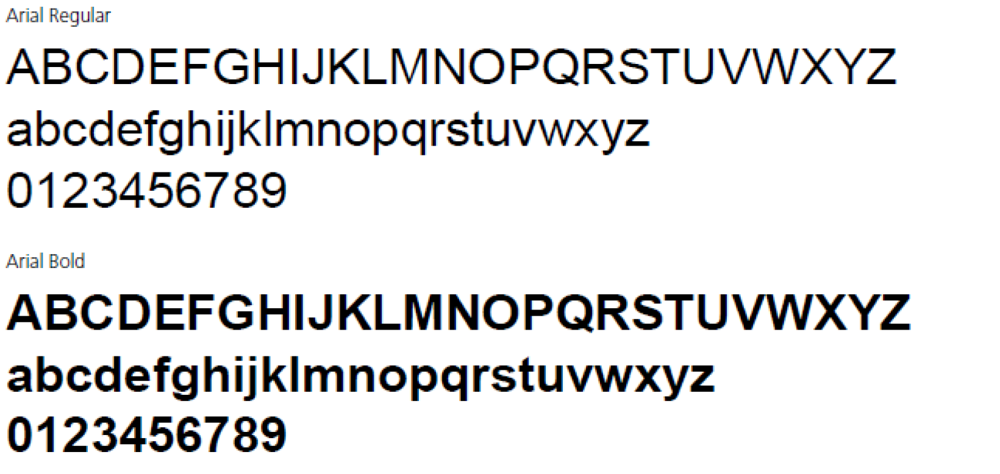
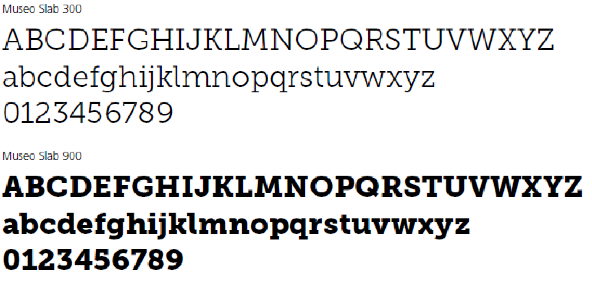
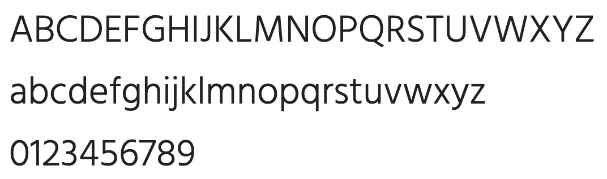
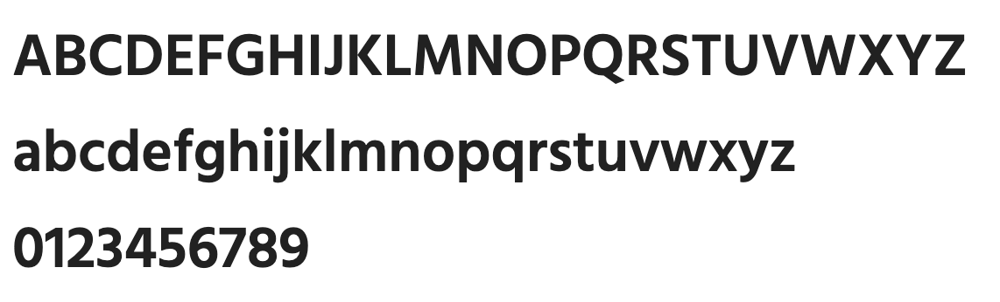

# Typografie
Die Typografie spielt eine entscheidende Rolle in der visuellen Kommunikation und trägt massgeblich zur Wahrnehmung und Wiedererkennung einer Marke bei. Im Folgenden werden die verschiedenen Schriftarten und deren spezifische Anwendungen für die Korrespondenz, Drucksachen und Webanwendungen beschrieben.

## Korrespondenzschriftart (Office)

### Arial
Die Korrespondenzschrift gilt für alle Office-Anwendungen (z.B. Briefe, interne Dokumente, E-Mails).

<Columns> 
    <Columns> 
        <Column className='text--left'>
            | Schriftart | Schriftgrösse | Verwendung |
            |------------|-------------|-------------|
            | Arial Regular  | - 12 Untertitel   - 10 Text | Lauftext |
            | Arial Bold  | - 17 (Titel/Überschrift 1)  - 15 (Überschrift 2)  - 10 (Überschrift 3)  | Titel, Auszeichnungen |
        </Column>
        <Column className='text--left'>
            
        </Column>
    </Columns>
</Columns>

## Hausschrift für Drucksachen

### Frutiger
Für alle gedruckten Kommunikationsmittel kommt die Hausschrift **Frutiger** in zwei verschiedenen Schnitten zum Einsatz.

<Columns> 
    <Columns> 
        <Column className='text--left'>
            | Schriftart | Verwendung |
            |------------|-------------|
            | Frutiger 45 Light   | Logoschrift, Lauftext, Tabellen |
            | Frutiger 65 Bold   | Logoschrift (1. Zeile), Zwischentitel, Auszeichnungen |
        </Column>
        <Column className='text--left'>
            
        </Column>
    </Columns>
</Columns>

### Museo Slab
Die zusätzliche Serifenschrift **Museo Slab** sorgt für Emotionalität und Spannung in der grafischen Umsetzung von Kommunikationsmitteln und wird ebenfalls in zwei Schnitten eingesetzt.

<Columns> 
    <Columns> 
        <Column className='text--left'>
            | Schriftart | Verwendung |
            |------------|-------------|
            | Museo Slab 300   | Untertitel, Zitate |
            | Museo Slab 900   | Headlines, Kampagne «Meter über», Auszeichnungen |
        </Column>
        <Column className='text--left'>
            
        </Column>
    </Columns>
</Columns>

## Webseite
Ausgehend von den eingesetzten Schriftarten auf der Website des Zentralverbands (www.sac-cas.ch), werden folgende Schriftarten für die Webanwendungen definiert.

<Columns> 
    <Columns> 
        <Column className='text--left'>
            | Schriftart | Verwendung |
            |------------|-------------|
            | Hind SemiBold 600   | Titel, Auszeichnungen |
            | Hind Light 300   | Lauftext |
        </Column>
        <Column className='text--left'>
            
            
        </Column>
    </Columns>
</Columns>
