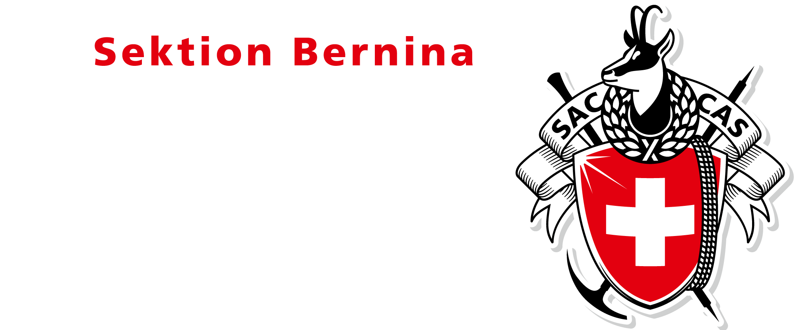

import {Signatur} from '@site/src/components/E-Mail-Signatur';

# Vorlagen
In diesem Abschnitt sind verschiedene Vorlagen und Ressourcen aufgelistet, die bei der Erstellung von Dokumenten und Präsentationen helfen. Bitte stets die hier bereitgestellten Vorlagen nutzen, um den jeweils aktuellsten Stand zu nutzen und somit ein einheitliches und professionelles Erscheinungsbild zu gewährleisten.

## Logo
Die Anwendungsrichtlinien der Logos sind im Bereich [Logo](./logo) zu finden.

### Standard
<Columns> 
    <Column className='text--left'>
        | Format         | Download Link                                                    |
        |----------------|------------------------------------------------------------------|
        | EPS            | [Download EPS](./assets/logo/sektion/sektion_bernina.eps)        |
        | SVG            | [Download SVG](./assets/logo/sektion/sektion_bernina.svg)        |
        | PNG (2000px)   | [Download PNG](./assets/logo/sektion/sektion_bernina_2000px.png) |
        | JPG (2000px)   | [Download JPG](./assets/logo/sektion/sektion_bernina_2000px.jpg) |
    </Column>
    <Column className='text--center'>
        
    </Column>
</Columns>

### Negativ-Variante
<Columns> 
    <Column className='text--left'>
        | Format         | Download Link                                                    |
        |----------------|------------------------------------------------------------------|
        | EPS            | [Download EPS](./assets/logo/sektion/sektion_bernina_negativ.eps)        |
        | SVG            | [Download SVG](./assets/logo/sektion/sektion_bernina_negativ.svg)        |
        | PNG (2000px)   | [Download PNG](./assets/logo/sektion/sektion_bernina_negativ_2000px.png) |
    </Column>
    <Column className='text--center background--dark'>
         
        
    </Column>
</Columns>

### Graustufen
<Columns> 
    <Column className='text--left'>
        | Format         | Download Link                                                    |
        |----------------|------------------------------------------------------------------|
        | EPS            | [Download EPS](./assets/logo/sektion/sektion_bernina_graustufen.eps)        |
        | SVG            | [Download SVG](./assets/logo/sektion/sektion_bernina_graustufen.svg)        |
        | PNG (2000px)   | [Download PNG](./assets/logo/sektion/sektion_bernina_graustufen_2000px.png) |
    </Column>
    <Column className='text--center'>
         
        
    </Column>
</Columns>

### Kleinstanwendung
**Achtung!** Die Kleinstanwendung ist sehr eingeschränkt möglich. Die Anwendungsrichtlinien des Logos in Kleinstanwendung sind im Bereich [Logo](./logo) zu finden.

<Columns> 
    <Column className='text--left'>
        | Format      | Download Link                                                |
        |-------------|--------------------------------------------------------------|
        | SVG         | [Download SVG](./assets/logo/kleinstanwendung/logo.svg)         |
        | PNG 1000px  | [Download PNG 1000px](./assets/logo/kleinstanwendung/logo_1000px.png) |
        | PNG 500px   | [Download PNG 500px](./assets/logo/kleinstanwendung/logo_500px.png)   |
        | Favicon     | [Download Favicon](./assets/logo/kleinstanwendung/favicon.ico)  |
    </Column>
    <Column className="text--right">
    
    </Column>
</Columns> 

## Office
- [Download Word - Briefvorlage](./assets/vorlagen/Briefvorlage.docx)
- [Download Word - Konzeptvorlage](./assets/vorlagen/Konzeptvorlage.docx)
- [Download PowerPoint - Präsentation](./assets/vorlagen/Praesentation.pptx)

## PDF-Wasserzeichen
- [Download PDF-Wasserzeichen (A4)](./assets/vorlagen/wasserzeichen_a4.pdf)

## E-Mail Signatur
- Die E-Mail Signatur soll mittels Signatur-Genarator erstellt werden.
- Auf die Verwendung des Logos in der E-Mail-Signatur wird verzichtet. Dies aus Gründen der Kompatibilität (Auflösung, Grösse, Anzeige in verschiedenen Mailprogrammen) und zur Reduktion von Spam.

### Generator
<Signatur></Signatur>

